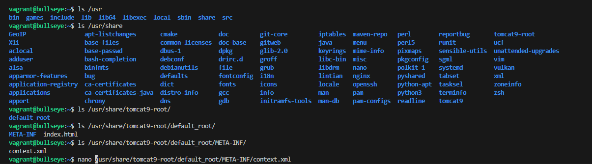
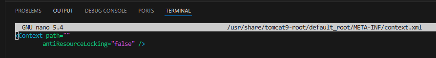
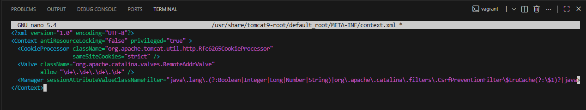

# Tomcat juanma
- Lo primero que he hecho es usar de base el nginx

# Instalacion de Tomcat
- Lo primero es instalar openJDK (sudo apt install -y openjdk-11-jdk)

- Lo siguiente es el paquete de tomcat (sudo apt install -y tomcat9)

## Creacion de grupo
- Creamos un grupo para los usuarios de tomcat (sudo groupadd tomcat9)
- Creamos usuario. (sudo useradd -s /bin/false -g tomcat9 -d /etc/tomcat9 tomcat9)
        - "-s /bin/false": Establece un interprete de comandos lo hace false para que el usuario no inidcie sesión.
        - "-g tomcat9": Establece grupo principal.
        - "-d /etc/tomcat9": Establece un directorio de inicio de usuario.
        - y por ultimo le damos el nombre al usuario en este caso tomcat9

## Comprobamos y iniciamos el servicio
- Para esto tenemos que utilizar un systemctl start para iniciar el servicio y para comprobar un status.

- Para acceder a el podemos acceder de diferentes formas con localhost:8080 pero esto si usamos un ubuntu grafico, si es remeto lo que tenemos que hacer es accedir al fichero context.xml dentro del directorio "/usrna/share/tomcat9-admin/host-manager/META-INF/" (EN MI CASO NO ME SALE CON tomcat9-admin yo tengo que poner tomcat9-root) y cambiarlo por: 

- lo reiniciamos el servicio 

## Configuracion de la administración
- Ahora vamos a definir el usuario con acceso a Tomcat 

