# Tomcat juanma
- Lo primero que he hecho es usar de base el nginx

# Instalacion de Tomcat
- Lo primero es instalar openJDK (sudo apt install -y openjdk-11-jdk)
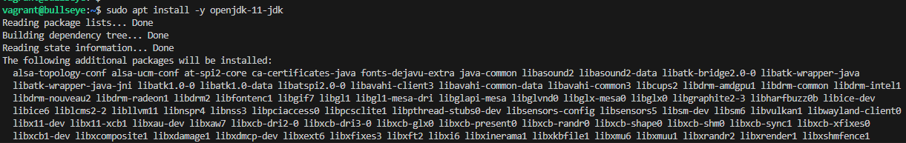
- Lo siguiente es el paquete de tomcat (sudo apt install -y tomcat9)
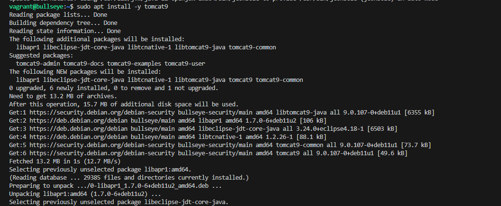

## Creacion de grupo
- Creamos un grupo para los usuarios de tomcat (sudo groupadd tomcat9)
- Creamos usuario. (sudo useradd -s /bin/false -g tomcat9 -d /etc/tomcat9 tomcat9)
        - "-s /bin/false": Establece un interprete de comandos lo hace false para que el usuario no inidcie sesión.
        - "-g tomcat9": Establece grupo principal.
        - "-d /etc/tomcat9": Establece un directorio de inicio de usuario.
        - y por ultimo le damos el nombre al usuario en este caso tomcat9
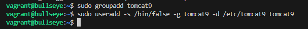

## Comprobamos y iniciamos el servicio
- Para esto tenemos que utilizar un systemctl start para iniciar el servicio y para comprobar un status.
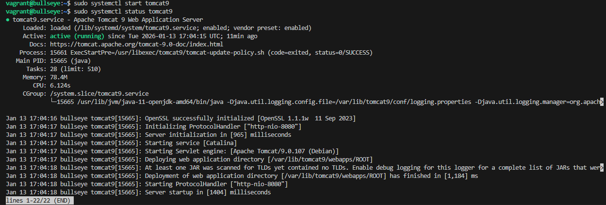
- Para acceder a el podemos acceder de diferentes formas con localhost:8080 pero esto si usamos un ubuntu grafico, si es remeto lo que tenemos que hacer es usar el comando  hostname -I para saber la ip, con esto buscamos desde windows la ip de la maquina y añadimos :8080
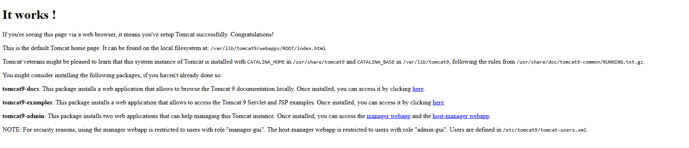

## Configuracion de la administración
- Ahora vamos a definir el usuario con acceso a Tomcat 
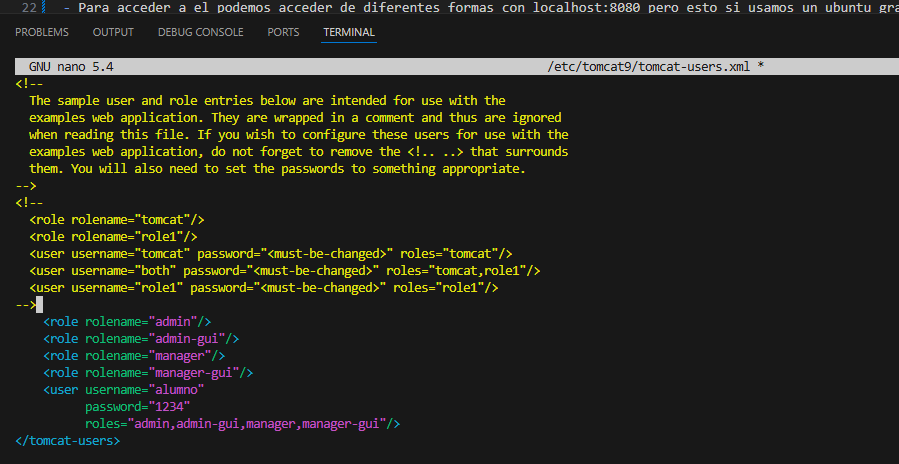

## Instalacion de adminsitrador web
- instalamos servicio

- ahora nos metemos en "http://localhost:8080/manager/html" que en caso de windows es con la ip, y nos pedira registrarnos y ponemos alumno y contraseña 1234
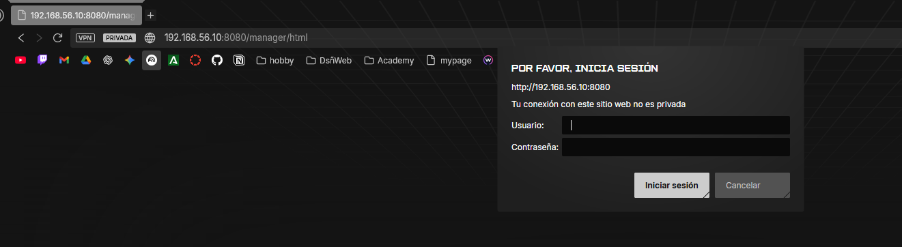
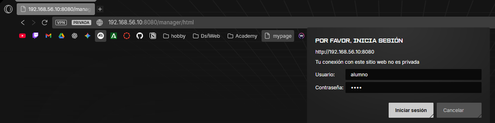
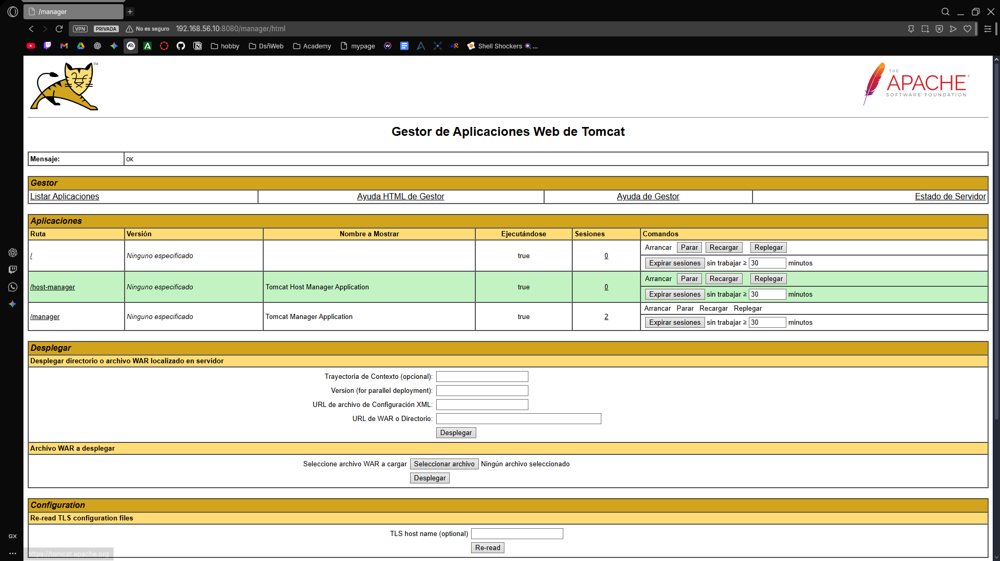

- Y ahora lo hacemos en la ruta "http://localhost:8080/host-manager/html"
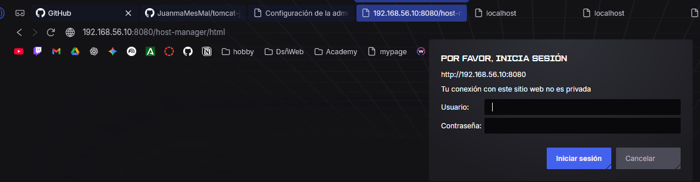
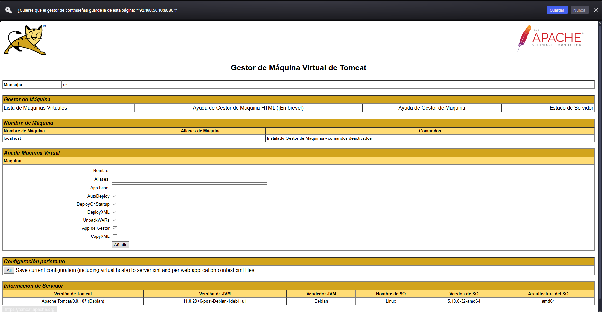

## Despliegue manual mediante GUI
-Nos descargamos el archivo tomcat1.war y luego lo añadimos en la seccion que nos permite desplegar war manuelmente y lo añadimos
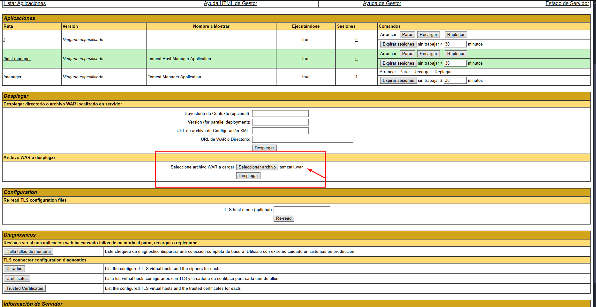
- Comprobamos que funciona 
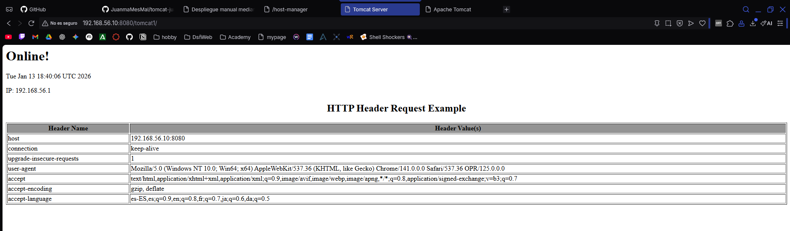

# Despliegue con Maven
## Instalación de Maven
- Instalamos el servicio. (sudo apt-get update && sudo apt-get -y install maven)
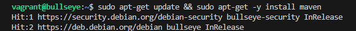
        - comprobamos con mvn --v
        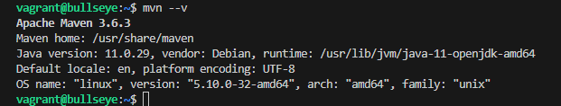

## Configuración
- Añadimos en el archivo de tomcat-users.xml otro usuario y contraseña
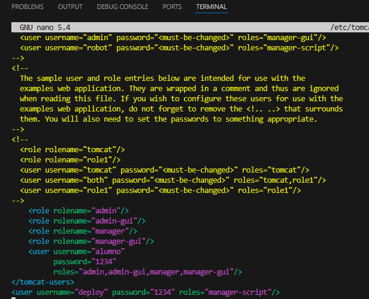
- Luego vamos a modificar el archivo settings.xml en la ruta /etc/maven/settings.xml
